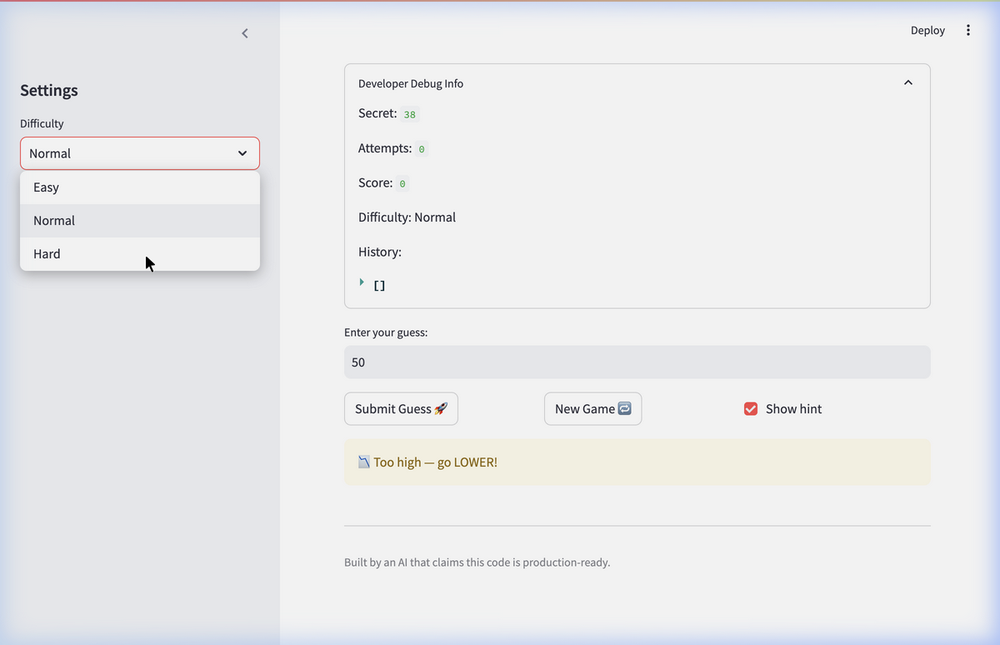

# 🎮 Game Glitch Investigator: The Impossible Guesser

## 🚨 The Situation

You asked an AI to build a simple "Number Guessing Game" using Streamlit.
It wrote the code, ran away, and now the game is unplayable. 

- You can't win.
- The hints lie to you.
- The secret number seems to have commitment issues.

## 🛠️ Setup

1. Install dependencies: `pip install -r requirements.txt`
2. Run the broken app: `python -m streamlit run app.py`

## 🕵️‍♂️ Your Mission

1. **Play the game.** Open the "Developer Debug Info" tab in the app to see the secret number. Try to win.
2. **Find the State Bug.** Why does the secret number change every time you click "Submit"? Ask ChatGPT: *"How do I keep a variable from resetting in Streamlit when I click a button?"*
3. **Fix the Logic.** The hints ("Higher/Lower") are wrong. Fix them.
4. **Refactor & Test.** - Move the logic into `logic_utils.py`.
   - Run `pytest` in your terminal.
   - Keep fixing until all tests pass!

## 📝 Document Your Experience

### Game Purpose

This is a Streamlit-based number guessing game where the player tries to guess a randomly generated secret number within a limited number of attempts. The game provides hint feedback ("Too High" or "Too Low") after each guess and tracks the player's score. Three difficulty levels (Easy, Normal, Hard) control the size of the number range and the number of attempts allowed.

### Bugs Found

1. **Inverted hint messages** — The `check_guess` function returned the correct outcome label (`"Too High"` / `"Too Low"`) but the user-facing message was backwards. When the guess was too high, it said "Go HIGHER!" instead of "Go LOWER!", leading the player in the wrong direction every time.

2. **Wrong Hard difficulty range** — Hard mode used range `(1, 50)` while Normal used `(1, 100)`. This made Hard mode *easier* than Normal since there were fewer numbers to guess from.

3. **Broken new-game reset** — Clicking "New Game" only reset the attempt counter and generated a new secret. It did not clear the score, game status, or guess history, so the game would still show "You already won" or "Game over" after resetting.

4. **Secret-to-string type cast** — On even-numbered attempts, the code converted the secret to a string before passing it to `check_guess`, causing type-mismatch comparisons that gave wrong results.

5. **Off-by-one attempt counter** — Attempts were initialized at `1` instead of `0`, so the first guess counted as attempt #2.

### Fixes Applied

| Bug | Fix | File |
|-----|-----|------|
| Inverted hints | Swapped the message text so "Too High" → "go LOWER!" and "Too Low" → "go HIGHER!" | `logic_utils.py` |
| Wrong Hard range | Changed Hard from `(1, 50)` to `(1, 500)` | `logic_utils.py` |
| Broken reset | Reset all session state fields (score, status, history, attempts, secret) | `app.py` |
| String type-cast | Removed the `str()` conversion; secret is always compared as an `int` | `app.py` |
| Off-by-one | Changed initial attempt count from `1` to `0` | `app.py` |
| Mixed concerns | Refactored all game logic into `logic_utils.py`; `app.py` now handles only UI | Both files |

## 📸 Demo

### Fixed Game — Correct Hint Direction



### Pytest Results — All 15 Tests Passing

```
============================= test session starts ==============================
collected 15 items

tests/test_game_logic.py::test_winning_guess PASSED                      [  6%]
tests/test_game_logic.py::test_guess_too_high PASSED                     [ 13%]
tests/test_game_logic.py::test_guess_too_low PASSED                      [ 20%]
tests/test_game_logic.py::test_too_high_message_says_lower PASSED        [ 26%]
tests/test_game_logic.py::test_too_low_message_says_higher PASSED        [ 33%]
tests/test_game_logic.py::test_hard_range_wider_than_normal PASSED       [ 40%]
tests/test_game_logic.py::test_easy_range_narrower_than_normal PASSED    [ 46%]
tests/test_game_logic.py::test_all_ranges_start_at_one PASSED            [ 53%]
tests/test_game_logic.py::test_parse_valid_integer PASSED                [ 60%]
tests/test_game_logic.py::test_parse_empty_string PASSED                 [ 66%]
tests/test_game_logic.py::test_parse_non_numeric PASSED                  [ 73%]
tests/test_game_logic.py::test_parse_decimal_truncates PASSED            [ 80%]
tests/test_game_logic.py::test_score_increases_on_win PASSED             [ 86%]
tests/test_game_logic.py::test_score_decreases_on_miss PASSED            [ 93%]
tests/test_game_logic.py::test_win_bonus_decreases_with_attempts PASSED  [100%]

============================== 15 passed in 0.02s ==============================
```

## 🚀 Stretch Features

- [ ] [If you choose to complete Challenge 4, insert a screenshot of your Enhanced Game UI here]
